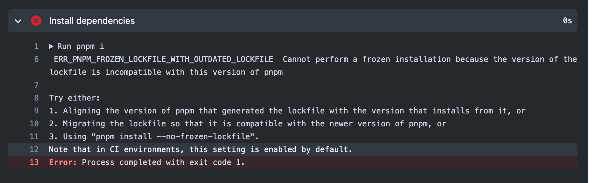

brew install tree

进入目录

tree -l 文件名 >README.md

意思是在 README.md 文件显示文件树

tree -l docs/.vitepress/theme >README.md

```tree
docs/.vitepress/theme
├── index.ts
└── style
    └── var.css
```

## gitee

git remote add gitee https://gitee.com/codercup/unibest-docs.git
git push -u gitee "main"

## 提示

本地 `pnpm` 是 `7.30.0`, `deploy.yml` 里面的 `pnpm` 的 `version` 不能填 `8`, 要改为 `7`， 否则报错：

