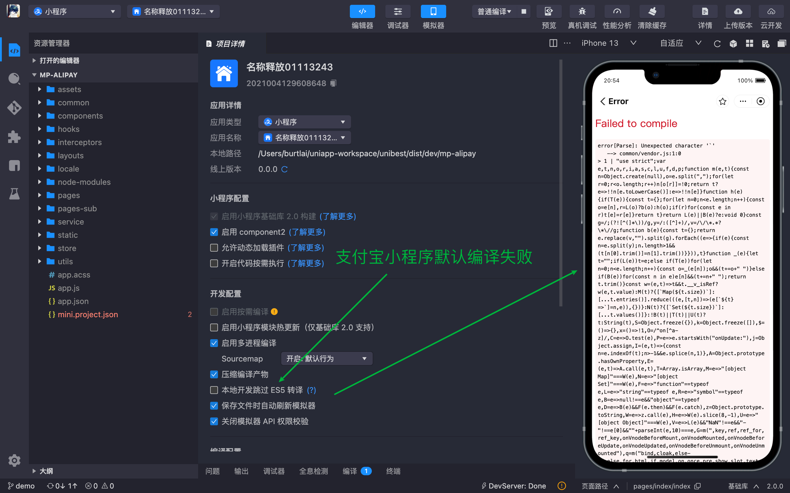

# 常见问题

## 1. 如何设置/修改首页？

`route-block` 块里面设置 `type="home"` 即可，请确保项目里面 `只有一个页面` 是这个配置。

> 注意：如果有多个，会按照字母顺序排列，可能不是您的想要的效果。

## 2.修改 `pages.json`、`manifest.json` 被覆盖问题

- `pages.json`

本项目引入了 `@uni-helper/vite-plugin-uni-pages`，`pages.json` 文件将会自动生成，手动修改 `pages.json` 将会被覆盖。

全局的东西请在 `pages.config.ts` 里面配置，页面的东西请在 `vue` 文件的 `route` 代码快配置。详情请看 [Uni 插件](/guide/uni-plugin)。

- `manifest.json`

本项目引入了 `@uni-helper/vite-plugin-uni-manifest`，`manifest.json` 文件将会自动生成，手动修改 `manifest.json` 将会被覆盖。

需要修改的东西请在 `manifest.config.ts` 里面编写。

## 3.怎么分包？

`vite.config.ts` 里面有一个配置，如下：(其中 `subPackages` 就是用来分包的)

也可以查看 [过滤和分包 章节](/guide/uni-plugin#设置-pages-过滤和分包)
:::code-group

```ts [vite.config.ts]{3}
UniPages({
    exclude: ['**/components/**/**.*'],
    subPackages: ['src/pages-sub'], // 是个数组，可以配置多个
}),
```

:::

## 4.支持 `uni-app x` 吗？

不支持。但我们一直保持关注。[uni-app x 传送门](https://doc.dcloud.net.cn/uni-app-x/)

目前 `unibest` 已经有 `hbx` 模板，后续接入 `uni-app x` 会很容易，坐等官方发布。

目前 `uni-app x` 可以生成 `Android(kotlin)` 、`iOS(swift)` 和 `web` 端，其他端（ `各种小程序` 、`鸿蒙` ）还在适配中。

::: details
`uni-app x` 是官方宣称的下一代 `uni-app`，是一个跨平台应用开发引擎。`uni-app x` 没有使用 `js` 和 `webview`，它基于 `uts` 语言。在 `App端`，`uts` 在 `iOS `编译为 `swift`、在 `Android` 编译为 `kotlin`，完全达到了原生应用的功能、性能。

`Android(kotlin)` 最先上线，`iOS(swift)` 在 `2024年3月底` 上线。
:::

## 5.`git commit` 报错。

请看 `commitlint.config.ts` 里面的配置，需要满足对应的设定。根据自己的需要，可以修改 `commitlint.config.ts` 里面的配置。

## 6. 支付宝小程序运行报错。

勾选上 `本地开发跳过 ES5 转译` 即可。

- 默认运行是会报错的，如下图



- 只需要勾选上 `本地开发跳过 ES5 转译` 即可正常运行，如下图


## 7. 为什么 `UI库` 从 `uv-ui` 改为了 `wot-ui` ？

`wot-ui`(`wot-design-uni`) 是 `vue3 + ts` 开发的 `UI库`，相比 `uv-ui` 编码体验好很多，[wot-ui 文档链接](https://wot-design-uni.netlify.app/)。

`UI 选型` 文章请看我的掘金文章：[【unibest】 uniapp + vue3 模板 UI 框架选型](https://juejin.cn/post/7337513012393607207).

## 8. `uni-app` 无法使用 `process.env` 变量，怎么办？

使用 `import.meta.env` 替代！
