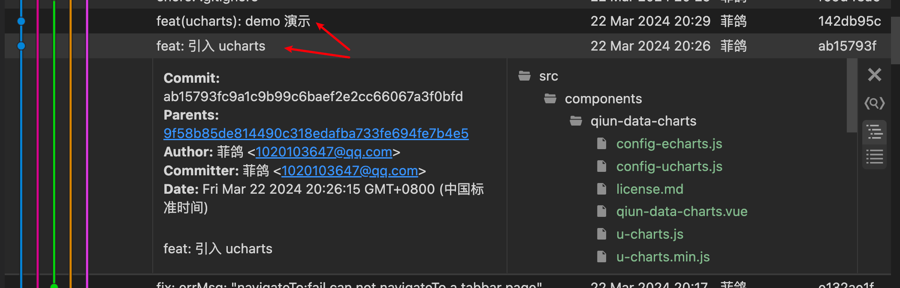

# ucharts

目前支持秋云图表库 `ucharts` [官网](https://www.ucharts.cn/v2/#/) 。

如果您已经 `clone` `unibest` 项目仓库，那么切换到 `ucharts` 分支即可。

如果想创建一个新的 `ucharts 项目`，运行下面的命令即可：

```sh
pnpm create unibest my-unibest -t ucharts
```

`ucharts` 效果图：


::: tip
引入过程的 `commit` 记录如下，供参考：


:::
