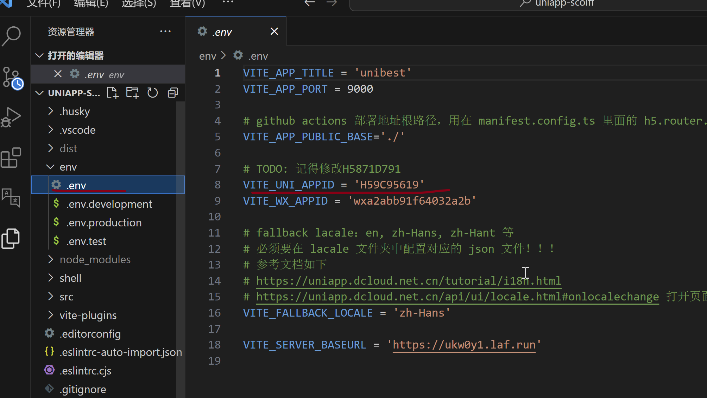
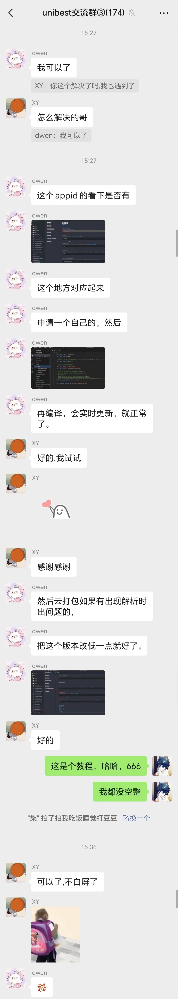

# APP 打包

很多开发者发现打包失败，或者打包白屏，感谢 `@dwen` 提供的打包方案，这里简单介绍一下。

- 重新获取自己的 `AppId`
  

- 根据上面获取到的 `AppId` 修改 `env/.env` 文件的 `VITE_UNI_APPID` 字段
  

- （可选）云打包如果有出现解析时出问题的，把 `minSdkVersion` 版本改低一点就好了，比如 `21`。（最低 `21`，不能低于 `21`；我模板里面设置的是 `30`）。
  

微信聊天记录如下（当做留念吧，哈哈）：

