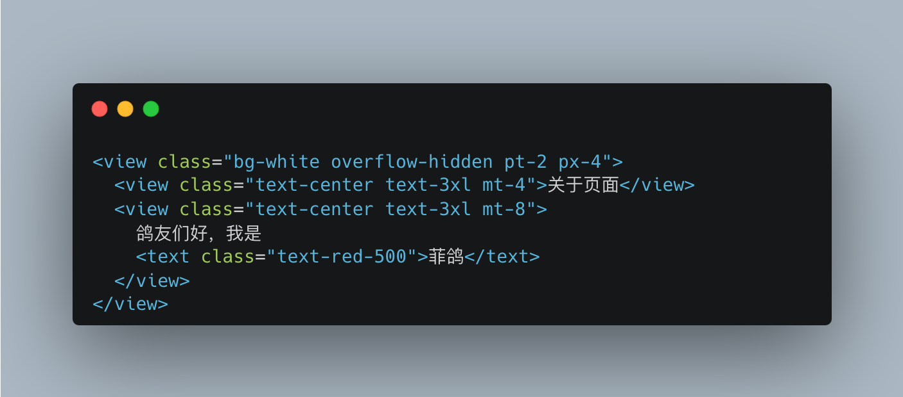
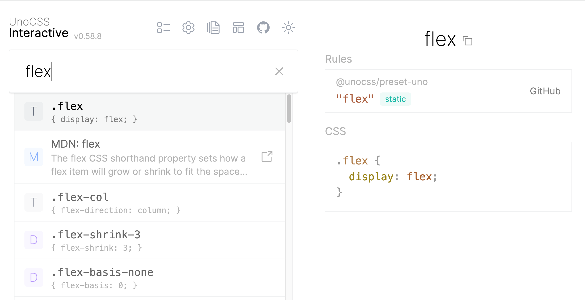

# CSS

本模块介绍 `UnoCSS` 和 `传统方式` 分别如何编写样式。

## UnoCSS

[UnoCSS](https://unocss.dev/) 是按需使用的原子 CSS 引擎，提供了良好的样式支持。



<!--
```html
<view class="bg-white overflow-hidden pt-2 px-4">
  <view class="text-center text-3xl mt-4">关于页面</view>
  <view class="text-center text-3xl mt-8">
    鸽友们好，我是<text class="text-red-500">菲鸽</text>
  </view>
</view>
``` -->

如果不记得原子类，可以查 `UnoCSS 的原子类`，[UnoCSS Interactive](https://unocss.dev/interactive/)



::: tip
如果原子化 `UnoCSS` 没有预览效果，请安装 `VSCode` 插件 `antfu.unocss`。
:::

常用的原子类：

::: details

- 宽高内外边距： `w-2`, `h-4`, `px-6`, `mt-8`等
- 前景色背景色：`text-green-400`, `bg-green-500`
- border: `border-2`, `border-solid`, `border-green-600`, `b-r-2` (注意 `border` = `border-1`，就是说边框 `1px` 时，一般简写为 `border` )
- border-radius: `rounded-full`, `rounded-6`, `rounded-sm` (不是 `br-10`, 也不是 `b-r-10`)
- line-height: `leading-10` (不是 `l-10`, 也不是 `lh-10`)
- hover: `hover:text-green-200`, `hover:bg-green-300`, `hover:border-dashed`
- flex: `flex`, `items-center`, `justify-center`, `flex-1`
  :::

## 传统方式

如果有设计稿，通常使用这种方式。以蓝湖为例，假如设计稿宽度为 `750px`，则直接复制样式代码到 css 代码，同时把 `px` 批量替换为 `rpx` 即可。

如果设计稿不是 `750px` 可以调整蓝湖的设置，让设计稿宽度为 `750px`。

::: details

`rpx` 是相对于基准宽度的单位，可以根据屏幕宽度进行自适应。`uni-app` 规定屏幕基准宽度 `750rpx`。

开发者可以通过设计稿基准宽度计算页面元素 `rpx` 值，设计稿 `1px` 与框架样式 `1rpx` 转换公式如下：

`设计稿 1px / 设计稿基准宽度 = 框架样式 1rpx / 750rpx`

换言之，页面元素宽度在 `uni-app` 中的宽度计算公式：

`750 * 元素在设计稿中的宽度 / 设计稿基准宽度`

举例说明：

若设计稿宽度为 `750px`，元素 `A` 在设计稿上的宽度为 `100px`，那么元素 `A` 在 `uni-app` 里面的宽度应该设为：`750 * 100 / 750`，结果为：`100rpx`。

若设计稿宽度为 `640px`，元素 `A` 在设计稿上的宽度为 `100px`，那么元素 `A` 在 `uni-app` 里面的宽度应该设为：`750 * 100 / 640`，结果为：`117rpx`。

若设计稿宽度为 `375px`，元素 `B` 在设计稿上的宽度为 `200px`，那么元素 `B` 在 `uni-app` 里面的宽度应该设为：`750 * 200 / 375`，结果为：`400rpx`。
:::

## 最佳实践

不必强求所有地方都使用 `UnoCSS`，如果设计稿在 `蓝湖`（或者类似的地方），已经提供了元素的完整样式，最好是使用 `传统方式` 编写样式，而不是拆解成 `原子化CSS`。

`原子化CSS` 和 `传统方式` 两者不是互斥的，他们是互补的，合适的地方使用合适的方式。
