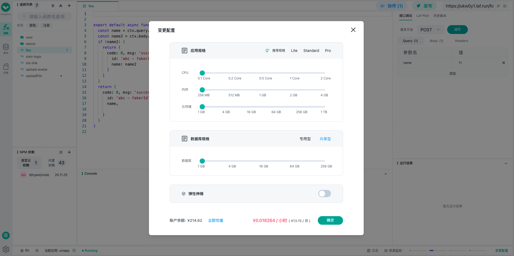

# 数据获取

`unibest` 使用 `uni-app` 的内置请求方法来获取数据，并内置了请求拦截，开箱即用。

## 请求

下面的代码块显示了 `请求封装文件` 和 `如何使用`。

::: code-group

```vue [src/pages/demo.vue]
<script lang="ts" setup>
import { getFooAPI, IFooItem } from '@/service/foo'
import { IResData } from '@/typings'

// 原始数据
const originalData = ref<IResData<IFooItem>>()
// 只包含真正的data数据
const data = ref<IFooItem>()
const getFoo = async () => {
  const res = await getFooAPI('菲鸽')
  data.value = res.result
  originalData.value = res
}

// 数据重置示例
const reset = () => {
  data.value = undefined
  originalData.value = undefined
}
</script>
```

```ts [src/service/foot.ts]
import { http } from '@/utils/http'
import type { IFooItem } from './foo.d'

export { IFooItem }

/** get 请求 */
export const getFooAPI = (name: string) => {
  return http<IFooItem>({
    url: `/foo`,
    method: 'GET',
    query: { name },
  })
}

/** get 请求 */
export const postFooAPI = (name: string) => {
  return http<IFooItem>({
    url: `/foo`,
    method: 'POST',
    query: { name }, // post 请求也支持 query
    data: { name },
  })
}
```

:::

请求使用流程截图如下：


## laf 云开发

博主的后台使用的 `laf` 云开发平台，博主的 `laf` 推荐码是 [https://laf.run/signup?code=ohaOgIX](https://laf.run/signup?code=ohaOgIX)，欢迎前往体验。

新用户注册 `laf` 即送 `10元`，服务可以随时停用启用，停用期间不收费，我的应用一个月就 `13.15元`，如果长时间关闭更便宜。


