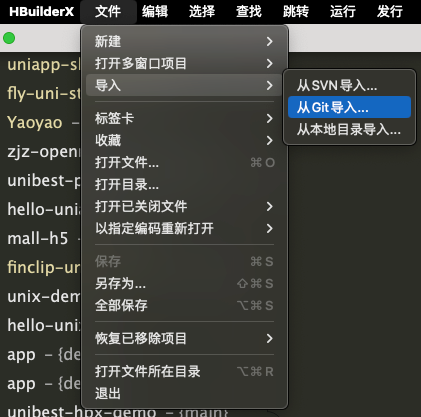
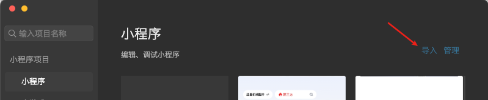
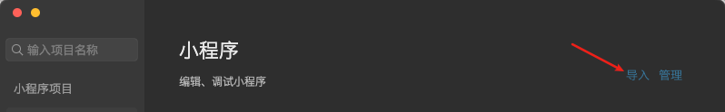
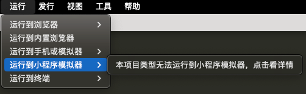
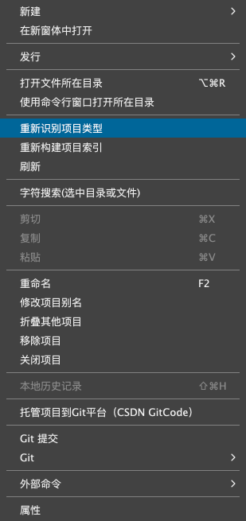
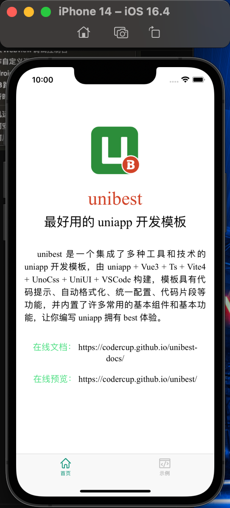

# hbx 版本

`unibest` 也提供 `hbx` 版本，方便喜欢 HBuilder 的开发者使用，操作如下。

## 仓库地址

没有梯子的用户优先推荐使用 `gitee` 仓库，速度更快。（两个仓库会实时同步，无差别。）

- gitee: [https://gitee.com/codercup/unibest-hbx.git](https://gitee.com/codercup/unibest-hbx.git)
- gitee: [https://github.com/codercup/unibest-hbx.git](https://github.com/codercup/unibest-hbx.git)

## 导入项目

有 2 种方式导入项目：

- 从 `Git` 导入...
- 从本地目录导入...

## 运行项目

此时运行菜单会提示 `本项目类型无法运行`，如下图

需要执行如下 2 步：

- 项目下执行 `pnpm i`
- 右键项目，选择 `重新识别项目类型`

  

## 运行效果

- ios 模拟器运行效果如下：

  
  
  

- 微信小程序运行效果如下：

  

> 目前微信小程序静态资源还有点问题，如下图 `logo 不见了`，后续会修复。

