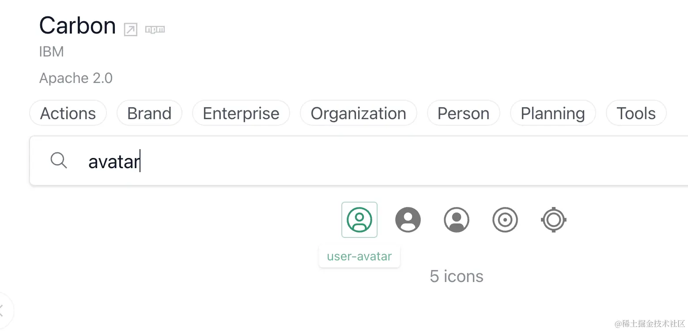
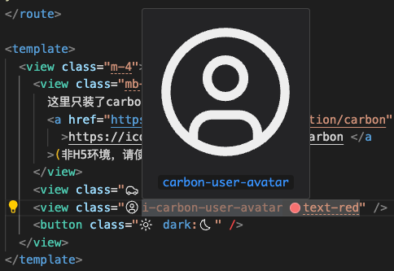

# 图标

模板基于 `UnoCSS Icons` 提供主要图标支持。当然，你可以使用传统的方式如 `iconfont`。

## 安装

在使用 `icones` 之前需要安装对应的图标库，安装格式如下：

`pnpm i -D @iconify-json/[the-collection-you-want]`

以安装 `carbon` 为例，执行 `pnpm i -D @iconify-json/carbon` 即可。

::: tip
`unibest` 已经装好了 `carbon` 图标库，可以直接使用。
:::

## 使用

打开网址：[https://icones.js.org/](https://icones.js.org/)

- 在里面找到某个库，如 `carbon`
  

- 搜索想要的图表，如 `avatar`，出现的搜索结果，查看类名，也可以点击图标，会出现详情

::: tip
也可以直接全局搜索，而非在某个图标库里面搜索。
:::

- 如上图，拿到 `carbon:user-avatar`
- 代码里面 `class` 填写 `i-carbon-user-avatar` 并且支持改颜色

