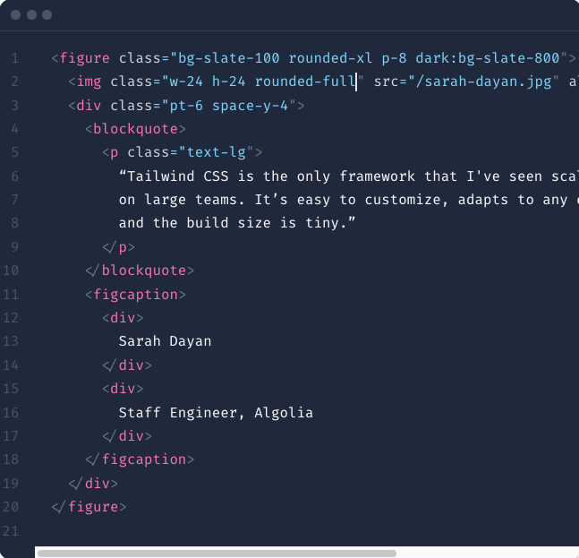
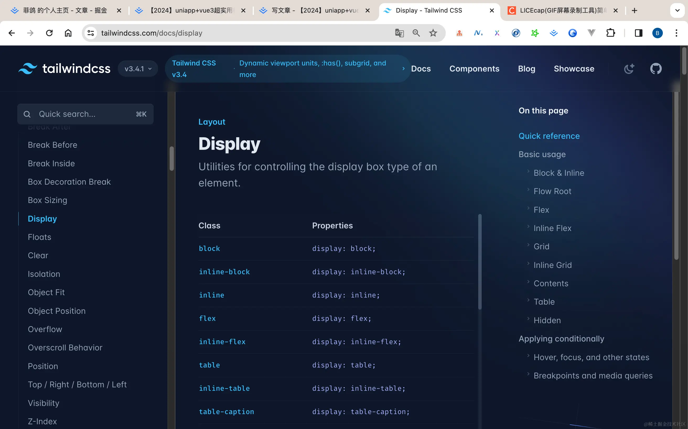

# 样式

模板基于 `UnoCSS` 提供主要样式支持。当然，你可以使用传统的方式编写样式。

## UnoCSS

[UnoCSS](https://unocss.dev/) 是按需使用的原子 CSS 引擎，提供了良好的样式支持。



<!--  -->

如果不记得原子类，可以查 `Tailwind CSS`，[Tailwind CSS 传送门](https://tailwindcss.com/docs/display)

常用的原子类：

- 宽高内外边距： `w-2`, `h-4`, `px-6`, `mt-8`等
- 前景色背景色：`text-green-400`, `bg-green-500`
- border: `border-2`, `border-solid`, `border-green-600`, `b-r-2` (注意 `border` = `border-1`，就是说边框 `1px` 时，一般简写为 `border` )
- border-radius: `rounded-full`, `rounded-6`, `rounded-sm` (不是 `br-10`, 也不是 `b-r-10`)
- line-height: `leading-10` (不是 `l-10`, 也不是 `lh-10`)
- hover: `hover:text-green-200`, `hover:bg-green-300`, `hover:border-dashed`
- flex: `flex`, `items-center`, `justify-center`, `flex-1`



## UnoCSS 多平台

模板内置了 [@uni-helper/unocss-preset-uni](https://github.com/uni-helper/unocss-preset-uni)，它在底层使用 [unocss-applet](https://github.com/unocss-applet/unocss-applet) 来兼容不同平台，并提供了按平台编写样式的能力。

```html
<!-- 只在 H5 编译时生成 mx-auto 类 -->
<view class="uni-h5:mx-auto"></view>
<!-- 只在 APP 编译时生成 mx-auto 类 -->
<view class="uni-app:mx-auto"></view>
<!-- 只在小程序编译时生成 mx-auto 类 -->
<view class="uni-mp:mx-auto"></view>
<!-- 只在微信小程序编译时生成 mx-auto 类 -->
<view class="uni-weixin:mx-auto"></view>
<!-- 只在支付宝小程序编译时生成 mx-auto 类 -->
<view class="uni-mp-alipay:mx-auto"></view>
```

::: tip
不必强求所有地方都使用 `UnoCSS`，如果设计稿在 `蓝湖`（或者类似的地方），已经提供了元素的完整样式，最好是使用 `传统的方式编写样式`，而不是拆解成 `原子化CSS`。

`原子化CSS` 和 `传统方式编写样式` 两者不是互斥的，他们是互补的，合适的地方使用合适的方式。
:::
